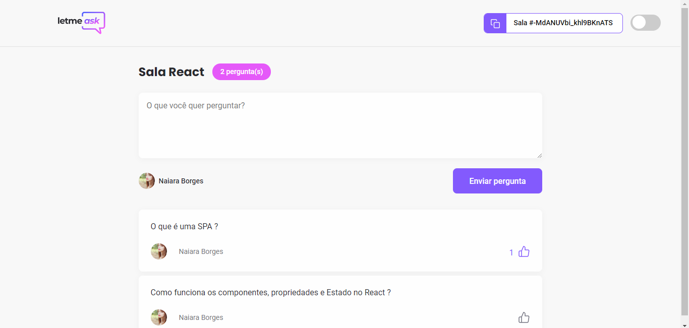
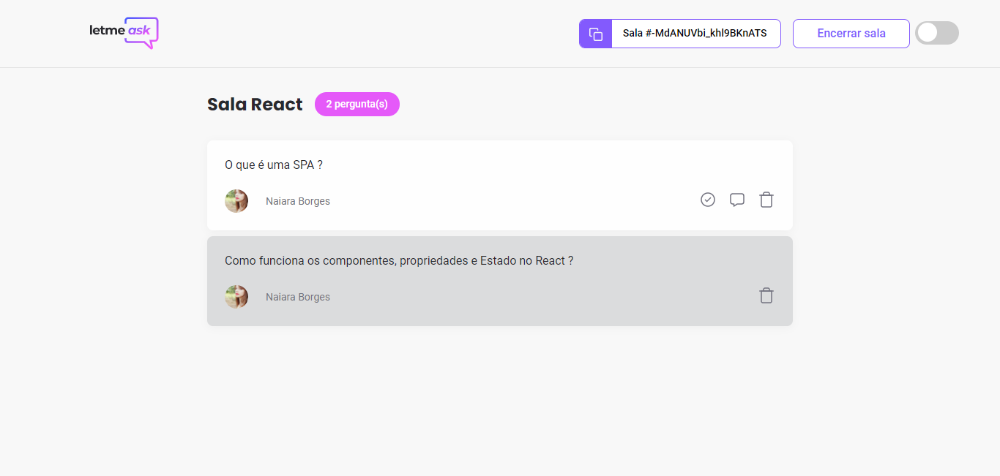

<h3 align="center">
     <br>
 
  
  ## :grey_question: :thought_balloon: Letmeask
<p>Esta aplicação consiste em ajudar os usuários na obtenção de perguntas por meio da plataforma com sistema de raqueamento com base em curtidas. O usuário poderá criar salas com base nos assuntos interessados, curtir as perguntas, responder e deletar. O app permite autenticação com o Google, além de possuir temas light e dark de acordo com a preferência do usuário.<br></p>
<br><p> This application consists of helping users to get questions through the platform with like-based hacking system. User can create rooms based on pertinent subjects, questions, answer and delete. The application allows authentication with Google, in addition to having light and dark themes according to the user's preference. </br></p>

## :desktop_computer:	 Tecnologias Utilizadas
- [React](https://pt-br.reactjs.org/)
- [TypeScript](https://www.typescriptlang.org/)
- [Sass](https://sass-lang.com/)
- [Firebase](https://console.firebase.google.com/)
- [Node.js](https://nodejs.org/en/)
- [Yarn](https://yarnpkg.com/)
- [Npm](npmjs.com)

## <dt> :gear: Instalações </dt>

```shell 

  $ yarn create react-app letmeask --template typescript
  $ yarn add firebase
  $ yarn add node-sass@^5.0.0
  $ yarn add react-router-dom
  $ yarn add @types/react-router-dom -D
  $ npm install react-icons
  $ npm install classnames

```
## <dt> :boom: Imagens da aplicação </dt>

####  <dt> 1. Página inicial </dt>

 

####  <dt> 2. Página para criar nova sala </dt>
 

#### <dt> 3. Página usuário </dt>


####  <dt> 4. Página Admin </dt>


####  <dt> 5. Tema Dark </dt>

